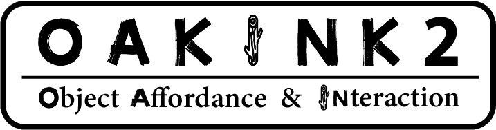
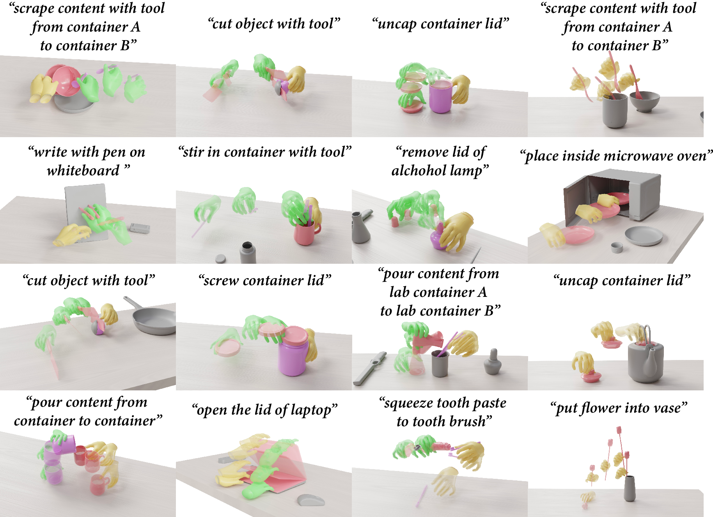

<p align="center">
  <p align="center">
    
  </p>
  <h2 align="center">Baseline Model: Task-aware Motion Fulfillment (TaMF)
</h2>

  <p align="center">
    <a href="https://github.com/kelvin34501"><strong>Xinyu Zhan*</strong></a>
    ·
    <a href="https://lixiny.github.io"><strong>Lixin Yang*</strong></a>
    ·
    <a href=""><strong>Yifei Zhao</strong></a>
    ·
    <a href=""><strong>Kangrui Mao</strong></a>
    ·
    <a href=""><strong>Hanlin Xu</strong></a>
    <br>
    <a href=""><strong>Zenan Lin</strong></a>
    ·
    <a href="https://kailinli.top"><strong>Kailin Li</strong></a>
    ·
    <a href="https://mvig.org"><strong>Cewu Lu</strong>&dagger;</a>
  </p>
  <h3 align="center">CVPR 2024</h3>

  <p align="center">
    <a href="https://arxiv.org/pdf/2403.19417.pdf">
      </a>
    <a href='https://oakink.net/v2'>
      </a>
    <a href="https://www.youtube.com/watch?v=u8fV1TWUvdQ"></a>
  </p>
</p>

This repo contains the training and evaluation of **TaMF models** on OakInk2 dataset.
TaMF targets at the **generation of hand motion sequences** that can **fulfill given object trajectories** conditioned on **task descriptions**.

<br><bf>
<p align="center">
  
</p>


<!-- :warning: This work is based on the **preview-c11b3ff2** commit (Oct,24,2024) of the OakInk2 dataset. -->
:warning: This work uses `object_raw` models, which are aligned and downsampled from the objects' raw scans.

## Get Started

1. Setup dataset files.

    Download tarballs from [huggingface](https://huggingface.co/datasets/kelvin34501/OakInk-v2).
    You will need the preview version annotation tarball for all sequences, the `object_raw` tarball, the `object_repair` tarball and the `program` tarball.
    Organize these files as follow:
    ```
    data
    |-- data
    |   `-- scene_0x__y00z++00000000000000000000__YYYY-mm-dd-HH-MM-SS
    |-- anno_preview
    |   `-- scene_0x__y00z++00000000000000000000__YYYY-mm-dd-HH-MM-SS.pkl
    |-- object_raw
    |-- object_repair
    `-- program
    ```

    Refer to [oakink2_toolkit](https://github.com/oakink/OakInk2) for more details.

2. Setup the enviroment.

    1. Create a virtual env of python 3.10. This can be done by either `conda` or python package `venv`.
    
        1. `conda` approach
            
            ```bash
            conda create -p ./.conda python=3.10
            conda activate ./.conda
            ```

        2. `venv` approach
            First use `pyenv` or other tools to install a python intepreter of version 3.10. Here 3.10.14 is used as example:

            ```bash
            pyenv install 3.10.14
            pyenv shell 3.10.14
            ```

            Then create a virtual environment:

            ```bash
            python -m venv .venv --prompt oakink2_tamf
            . .venv/bin/activate
            ```
    
    2. Install the dependencies.

        Make sure all bundled dependencies are there.
        ```bash
        git submodule update --init --recursive --progress
        ```

        Use `pip` to install the packages:
        ```bash
        pip install -r requirements.dist.txt
        ```

# Train

1. Download the [MANO model](https://mano.is.tue.mpg.de) (version v1.2) and place the files at `asset/mano_v1_2`.

        The directory structure should be like:
        ```
        asset
        `-- mano_v1_2
            `-- models
                |-- MANO_LEFT.pkl
                `-- MANO_RIGHT.pkl
        ```

2. Download [object embeddings](https://huggingface.co/kelvin34501/OakInk2-TaMF/blob/main/retrieve_obj_embedding.tar.xz) and [sampled point clouds](https://huggingface.co/kelvin34501/OakInk2-TaMF/blob/main/retrieve_obj_pointcloud.tar.xz).

    Untar the tarballs into `common`. The directory structure should be like:
    ```
    common
    |-- common/retrieve_obj_embedding/main/embedding
    `-- common/retrieve_obj_pointcloud/main/pointcloud
    ```

    Download [grabnet assets](https://huggingface.co/kelvin34501/OakInk2-TaMF/blob/main/encoder__fid_1.tar.xz). Untar the tarballs into `asset`.
    ```
    asset
    `-- grabnet
    ```
    There assets are from `https://github.com/otaheri/GrabNet` and `https://github.com/oakink/OakInk-Grasp-Generation`.

3. Save cache dict for each split.

    Train:
    ```bash
    python -m script.save_cache_dict --data.process_range ?(file:asset/split/train.txt) --data.split_name train --commit
    ```

    Val:
    ```bash
    python -m script.save_cache_dict --data.process_range ?(file:asset/split/val.txt) --data.split_name val --commit
    ```

    Test:
    ```bash
    python -m script.save_cache_dict --data.process_range ?(file:asset/split/test.txt) --data.split_name test --commit
    ```

    All Dataset:
     ```bash
    python -m script.save_cache_dict --data.process_range ?(file:asset/split/all.txt) --data.split_name all --commit
    ```

4. Train `MF-MDM G`.

    ```bash
    bash script/train.sh
    ```

5. Sample from `MF-MDM G` for data cache that will be used in `MF-MDM R` training (press y to proceed).

    ```bash
    ./script/sample.sh train common/train/main__<timestamp here>/save/model_0099.pt arch_mdm_l__0099
    ```

    ```bash
    ./script/sample.sh val common/train/main__<timestamp here>/save/model_0399.pt arch_mdm_l__0399
    ```

    ```bash
    ./script/sample.sh test common/train/main__<timestamp here>/save/model_0399.pt arch_mdm_l__0399
    ```

6. Train `MF-MDM R`.

    ```bash
    bash script/train_refine.sh
    ```

7. Sample from `MF-MDM R`.

    ```bash
    ./script/sample_refine.sh test common/train/refine__<timestamp>/save/model_0399.pt arch_mdm_l__0399
    ```

# Evaluation

1. (Optional) Download the pretrained model weights for [`MF-MDM G`](https://huggingface.co/kelvin34501/OakInk2-TaMF/blob/main/main__remastered.tar.xz)) and [`MF-MDM R`](https://huggingface.co/kelvin34501/OakInk2-TaMF/blob/main/refine__remastered.tar.xz). The directory structure should be like:
```
common
|-- common/train/main__remastered/save
`-- common/train/refine__remastered/save
```

2. Download the [feature-extraction model weights](https://huggingface.co/kelvin34501/OakInk2-TaMF/blob/main/encoder__fid_1.tar.xz) for FID computation in the paper. You could also use your own feature-extraction model if you would like to.
The directory structure should be like:
```
common
`-- common/train/encoder__fid_1/save
```

3. Sample from `MF-MDM R`. You can do it multiple times from different cache copies for evaluation.

    ```bash
    ./script/sample_refine.sh test common/train/refine__remastered/save/model_0399.pt arch_mdm_l__0399
    ```

4. Evaluate.

    Contact Ratio, CR:
    ```bash
    python -m script.compute_score.compute_score_cr
    ```

    Solid Intersection Volume, SIV:
    ```bash
    python -m script.compute_score.compute_score_siv
    ```

    Power Spectrum Kullback-Leibler divergence of Joints, PSKL-J:
    ```bash
    python -m script.compute_score.compute_score_psklj
    ```

    FID:
    ```bash
    python -m script.compute_score.compute_score_fid --cfg config/arch_encoder.yml --debug.encoder_checkpoint_filepath common/train/encoder__fid_1/save/model_0399.pt 
    ```

    Point `--sample_refine_filepath` to different saved sampled trajectories to do evaluations multiple times.

4. (Optional) Visualize.

```bash
python -m script.debug.debug_refine_sample --debug.model_weight_filepath xxx.pt
```

# Citation

If you find OakInk2 dataset or OakInk2-TAMF repo useful for your research, please considering cite us:

```bibtex
@InProceedings{Zhan_2024_CVPR,
    author    = {Zhan, Xinyu and Yang, Lixin and Zhao, Yifei and Mao, Kangrui and Xu, Hanlin and Lin, Zenan and Li, Kailin and Lu, Cewu},
    title     = {{OAKINK2}: A Dataset of Bimanual Hands-Object Manipulation in Complex Task Completion},
    booktitle = {Proceedings of the IEEE/CVF Conference on Computer Vision and Pattern Recognition (CVPR)},
    month     = {June},
    year      = {2024},
    pages     = {445-456}
}
```

<details><summary>Our TaMF model is based on the Motion Diffusion Model (MDM), please also cite: </summary>  

```bibtex
@inproceedings{
    tevet2023human,
    title={Human Motion Diffusion Model},
    author={Guy Tevet and Sigal Raab and Brian Gordon and Yoni Shafir and Daniel Cohen-or and Amit Haim Bermano},
    booktitle={The Eleventh International Conference on Learning Representations },
    year={2023},
    url={https://openreview.net/forum?id=SJ1kSyO2jwu}
}
```

</details>
